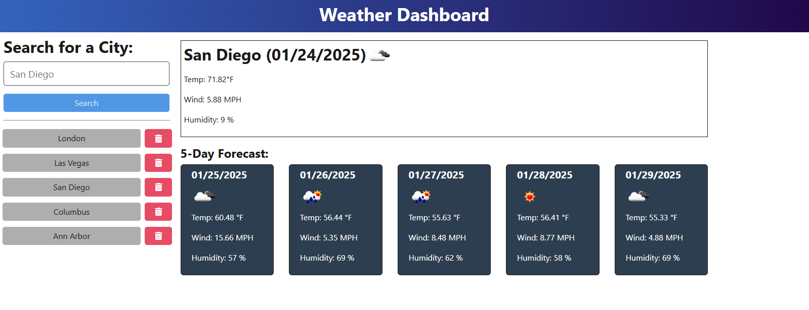

# 5dayWeatherForcast

## Description

This application provides a user with the weather forecast for the current day and the future 5 days for a specified city. Cities are searched for in entry box and the searched for city has its forecast listed. A list of previously searched cities are listed next to the forecast. Previously searched cities can be selected to show the forecast for the city or can be deleted from the list.

## Usage

The deployed website can be found at: https://fivedayweatherforcast.onrender.com/

Cities can be searched for in the "Search for a City" entry box. After clicking search, forecast will be populated with the 5 day forecast. Under the search box, the list of previously searched cities is shown. Clicking the cities in the list will update the forecasts with the select city. The cities can be removed from the list by clicking the trash can button next to city.

## Credits

Vijay Natarajan (github.com/santoshalper)